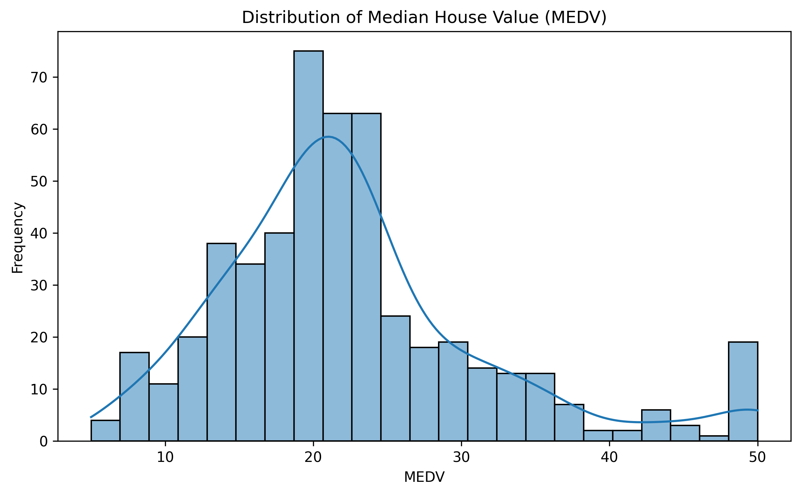
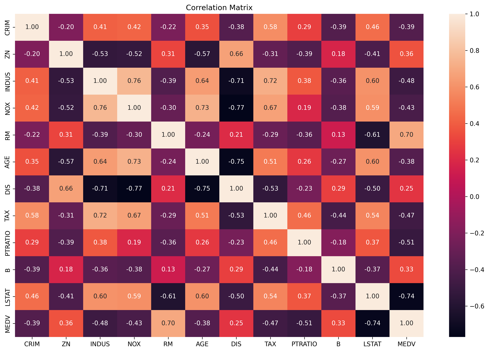
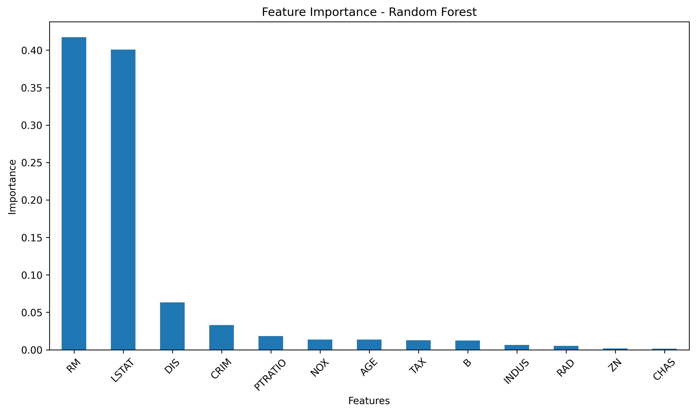
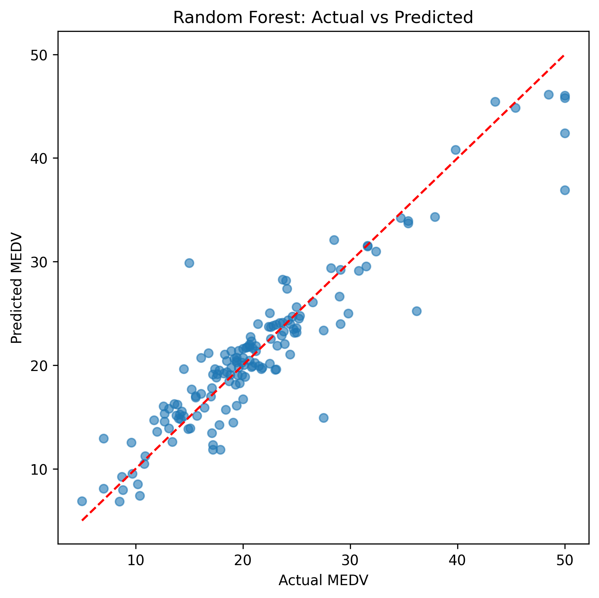

# Boston Housing Regression – Machine Learning Model Comparison

## Project Overview

This project develops and compares multiple supervised machine learning regression models for predicting **median house value (MEDV)** using the Boston Housing dataset.

The project demonstrates an end-to-end machine learning workflow including exploratory data analysis, preprocessing, model training, model evaluation, model comparison, and model interpretation using Random Forest feature importance.

## Objectives

* Perform exploratory data analysis (EDA)
* Analyze relationships between features and median house value
* Split the dataset into training and testing sets
* Apply feature scaling where required
* Train multiple regression models
* Evaluate model performance using RMSE, MAE, and R²
* Compare model performance across different approaches
* Analyze Random Forest feature importance
* Visualize actual versus predicted values

## Models Used

The project compares the following regression models:

1. Ordinary Least Squares (OLS)
2. Lasso Regression
3. Post-Lasso Regression
4. Ridge Regression
5. Elastic Net Regression
6. Decision Tree Regressor
7. Random Forest Regressor
8. Gradient Boosting Regressor
9. Neural Network Regressor

This provides a comparison between linear, regularized, tree-based, ensemble, and neural-network approaches.

## Machine Learning Workflow

```text
Data Loading
     ↓
Exploratory Data Analysis
     ↓
Train-Test Split
     ↓
Feature Scaling
     ↓
Model Training
     ↓
Prediction
     ↓
Model Evaluation
     ↓
Model Comparison
     ↓
Random Forest Feature Importance
     ↓
Visualization & Results Export
```

## Evaluation Metrics

The models are evaluated using three standard regression metrics:

### RMSE — Root Mean Squared Error

Measures the magnitude of prediction errors, giving greater weight to larger errors.

**Lower RMSE indicates lower prediction error.**

### MAE — Mean Absolute Error

Measures the average absolute difference between actual and predicted values.

**Lower MAE indicates lower prediction error.**

### R² — R-squared

Measures the proportion of variation in the target variable explained by the model.

**Higher R² indicates greater explanatory power.**

## Results

The project generates a model comparison table containing:

* RMSE
* MAE
* R²

The results are exported in both CSV and Excel formats for further analysis.

The project also generates four visualizations:

* MEDV distribution
* Correlation matrix
* Random Forest feature importance
* Random Forest actual vs predicted values

## Visualizations

### 1. MEDV Distribution

Shows the distribution of median house values in the dataset.



### 2. Correlation Matrix

Shows the pairwise correlations between numerical variables in the dataset.



### 3. Random Forest Feature Importance

Shows the relative importance assigned to input features by the Random Forest model.



### 4. Random Forest: Actual vs Predicted

Compares the actual MEDV values with the values predicted by the Random Forest model.



## Project Files

| File                                | Description                                            |
| ----------------------------------- | ------------------------------------------------------ |
| `ML- BOSTON HOUSING PRICE.py`       | Main Python script containing the complete ML workflow |
| `boston_housing_model_results.csv`  | Model comparison results in CSV format                 |
| `boston_housing_model_results.xlsx` | Model comparison results in Excel format               |
| `medv_distribution.png`             | Distribution of median house value                     |
| `correlation_matrix.png`            | Correlation matrix visualization                       |
| `feature_importance.png`            | Random Forest feature importance visualization         |
| `rf_actual_vs_predicted.png`        | Actual vs predicted visualization                      |
| `requirements.txt`                  | Python libraries required to run the project           |
| `.gitignore`                        | Files excluded from Git version control                |

## Dataset

The Boston Housing dataset is retrieved programmatically from **OpenML** using scikit-learn's `fetch_openml()` function.

The raw dataset is not stored separately in this repository because it is downloaded programmatically when the script is executed.

## Dataset Note

The Boston Housing dataset is a historical benchmark dataset and has documented limitations, including concerns surrounding some of its variables and its use as a modern benchmark.

In this project, it is used primarily for **educational purposes and demonstrating a complete regression modelling workflow**.

## Key Takeaways

This project demonstrates an end-to-end machine learning regression workflow covering:

* Exploratory data analysis
* Data preprocessing
* Feature scaling
* Multiple regression techniques
* Model evaluation
* Model comparison
* Ensemble learning
* Feature importance analysis
* Data visualization
* Exporting analytical results

It provides practical experience with **Python, Pandas, NumPy, Scikit-learn, Matplotlib, Seaborn, regression modelling, and model evaluation**.

